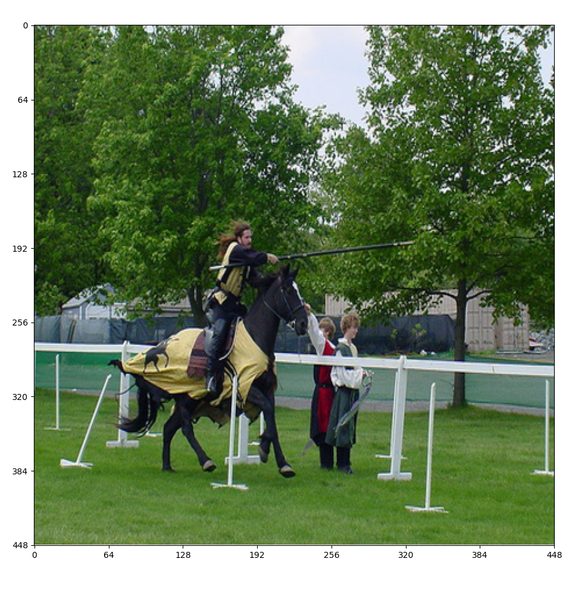
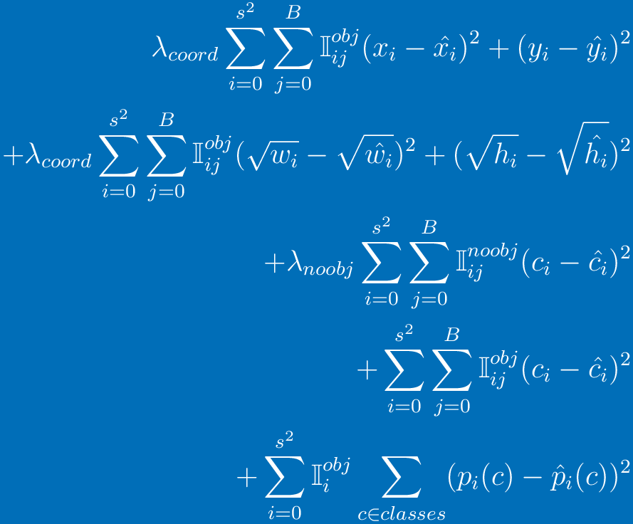

# To Do List
- [x] Downloading and preparing the data
- [x] Building the dataset class
- [x] Building the backbone architecture
- [x] Building the loss class
- [x] Adding data augmentation transforms
- [ ] Building the train script
- [ ] Building the eval script
- [ ] Building the detect script
- [ ] Building the evaluation metric class

<br><br> 

# PASCAL_VOC {2007, 2012} Dataset Loading

## Resizing the dataset
<table>
    <th>
        src
    </th>
    <th>
        resized
    </th>
    <tr>
        <td></td>
        <td></td>
    </tr>
</table>
<br><br>
    
## Dividing the image into 7×7 grid
<table>
    <th>
        resized
    </th>
    <th>
        grid
    </th>
    <tr>
        <td></td>
        <td></td>
    </tr>
</table>
<br><br>

## Localizing each box into its grid cell
<table>
    <th>
        grid
    </th>
    <th>
        labling
    </th>
    <tr>
        <td></td>
        <td></td>
    </tr>
    <tr>
        <td></td>
        <td></td>
    </tr>
</table>
<br><br><br>


# Darknet Architecture
```html
        Layer (type)               Output Shape         Param #
================================================================
            Conv2d-1         [-1, 64, 224, 224]           9,408
       BatchNorm2d-2         [-1, 64, 224, 224]             128
         LeakyReLU-3         [-1, 64, 224, 224]               0
         ConvBlock-4         [-1, 64, 224, 224]               0
         MaxPool2d-5         [-1, 64, 112, 112]               0
            Conv2d-6        [-1, 192, 112, 112]         110,592
       BatchNorm2d-7        [-1, 192, 112, 112]             384
         LeakyReLU-8        [-1, 192, 112, 112]               0
         ConvBlock-9        [-1, 192, 112, 112]               0
        MaxPool2d-10          [-1, 192, 56, 56]               0
           Conv2d-11          [-1, 128, 56, 56]          24,576
      BatchNorm2d-12          [-1, 128, 56, 56]             256
        LeakyReLU-13          [-1, 128, 56, 56]               0
        ConvBlock-14          [-1, 128, 56, 56]               0
           Conv2d-15          [-1, 256, 56, 56]         294,912
      BatchNorm2d-16          [-1, 256, 56, 56]             512
        LeakyReLU-17          [-1, 256, 56, 56]               0
        ConvBlock-18          [-1, 256, 56, 56]               0
           Conv2d-19          [-1, 256, 56, 56]          65,536
      BatchNorm2d-20          [-1, 256, 56, 56]             512
        LeakyReLU-21          [-1, 256, 56, 56]               0
        ConvBlock-22          [-1, 256, 56, 56]               0
           Conv2d-23          [-1, 512, 56, 56]       1,179,648
      BatchNorm2d-24          [-1, 512, 56, 56]           1,024
        LeakyReLU-25          [-1, 512, 56, 56]               0
        ConvBlock-26          [-1, 512, 56, 56]               0
        MaxPool2d-27          [-1, 512, 28, 28]               0
           Conv2d-28          [-1, 256, 28, 28]         131,072
      BatchNorm2d-29          [-1, 256, 28, 28]             512
        LeakyReLU-30          [-1, 256, 28, 28]               0
        ConvBlock-31          [-1, 256, 28, 28]               0
           Conv2d-32          [-1, 512, 28, 28]       1,179,648
      BatchNorm2d-33          [-1, 512, 28, 28]           1,024
        LeakyReLU-34          [-1, 512, 28, 28]               0
        ConvBlock-35          [-1, 512, 28, 28]               0
           Conv2d-36          [-1, 256, 28, 28]         131,072
      BatchNorm2d-37          [-1, 256, 28, 28]             512
        LeakyReLU-38          [-1, 256, 28, 28]               0
        ConvBlock-39          [-1, 256, 28, 28]               0
           Conv2d-40          [-1, 512, 28, 28]       1,179,648
      BatchNorm2d-41          [-1, 512, 28, 28]           1,024
        LeakyReLU-42          [-1, 512, 28, 28]               0
        ConvBlock-43          [-1, 512, 28, 28]               0
           Conv2d-44          [-1, 256, 28, 28]         131,072
      BatchNorm2d-45          [-1, 256, 28, 28]             512
        LeakyReLU-46          [-1, 256, 28, 28]               0
        ConvBlock-47          [-1, 256, 28, 28]               0
           Conv2d-48          [-1, 512, 28, 28]       1,179,648
      BatchNorm2d-49          [-1, 512, 28, 28]           1,024
        LeakyReLU-50          [-1, 512, 28, 28]               0
        ConvBlock-51          [-1, 512, 28, 28]               0
           Conv2d-52          [-1, 256, 28, 28]         131,072
      BatchNorm2d-53          [-1, 256, 28, 28]             512
        LeakyReLU-54          [-1, 256, 28, 28]               0
        ConvBlock-55          [-1, 256, 28, 28]               0
           Conv2d-56          [-1, 512, 28, 28]       1,179,648
      BatchNorm2d-57          [-1, 512, 28, 28]           1,024
        LeakyReLU-58          [-1, 512, 28, 28]               0
        ConvBlock-59          [-1, 512, 28, 28]               0
           Conv2d-60          [-1, 512, 28, 28]         262,144
      BatchNorm2d-61          [-1, 512, 28, 28]           1,024
        LeakyReLU-62          [-1, 512, 28, 28]               0
        ConvBlock-63          [-1, 512, 28, 28]               0
           Conv2d-64         [-1, 1024, 28, 28]       4,718,592
      BatchNorm2d-65         [-1, 1024, 28, 28]           2,048
        LeakyReLU-66         [-1, 1024, 28, 28]               0
        ConvBlock-67         [-1, 1024, 28, 28]               0
        MaxPool2d-68         [-1, 1024, 14, 14]               0
           Conv2d-69          [-1, 512, 14, 14]         524,288
      BatchNorm2d-70          [-1, 512, 14, 14]           1,024
        LeakyReLU-71          [-1, 512, 14, 14]               0
        ConvBlock-72          [-1, 512, 14, 14]               0
           Conv2d-73         [-1, 1024, 14, 14]       4,718,592
      BatchNorm2d-74         [-1, 1024, 14, 14]           2,048
        LeakyReLU-75         [-1, 1024, 14, 14]               0
        ConvBlock-76         [-1, 1024, 14, 14]               0
           Conv2d-77          [-1, 512, 14, 14]         524,288
      BatchNorm2d-78          [-1, 512, 14, 14]           1,024
        LeakyReLU-79          [-1, 512, 14, 14]               0
        ConvBlock-80          [-1, 512, 14, 14]               0
           Conv2d-81         [-1, 1024, 14, 14]       4,718,592
      BatchNorm2d-82         [-1, 1024, 14, 14]           2,048
        LeakyReLU-83         [-1, 1024, 14, 14]               0
        ConvBlock-84         [-1, 1024, 14, 14]               0
           Conv2d-85         [-1, 1024, 14, 14]       9,437,184
      BatchNorm2d-86         [-1, 1024, 14, 14]           2,048
        LeakyReLU-87         [-1, 1024, 14, 14]               0
        ConvBlock-88         [-1, 1024, 14, 14]               0
           Conv2d-89           [-1, 1024, 7, 7]       9,437,184
      BatchNorm2d-90           [-1, 1024, 7, 7]           2,048
        LeakyReLU-91           [-1, 1024, 7, 7]               0
        ConvBlock-92           [-1, 1024, 7, 7]               0
           Conv2d-93           [-1, 1024, 7, 7]       9,437,184
      BatchNorm2d-94           [-1, 1024, 7, 7]           2,048
        LeakyReLU-95           [-1, 1024, 7, 7]               0
        ConvBlock-96           [-1, 1024, 7, 7]               0
           Conv2d-97           [-1, 1024, 7, 7]       9,437,184
      BatchNorm2d-98           [-1, 1024, 7, 7]           2,048
        LeakyReLU-99           [-1, 1024, 7, 7]               0
       ConvBlock-100           [-1, 1024, 7, 7]               0
         Flatten-101                [-1, 50176]               0
          Linear-102                 [-1, 4096]     205,524,992
       LeakyReLU-103                 [-1, 4096]               0
          Linear-104                 [-1, 2450]      10,037,650
================================================================
Total params: 275,731,794
Trainable params: 275,731,794
Non-trainable params: 0
----------------------------------------------------------------
Input size (MB): 2.30
Forward/backward pass size (MB): 436.87
Params size (MB): 1051.83
Estimated Total Size (MB): 1491.00
----------------------------------------------------------------
```

<br><br><br>

# YOLO Loss


<!--  -->

```latex
\lambda_{coord}\sum_{i=0}^{s^2}\sum_{j=0}^{B}\mathbb{I}^{obj}_{ij}(x_i-\hat{x_i})^2+(y_i-\hat{y_i})^2
+\lambda_{coord}\sum_{i=0}^{s^2}\sum_{j=0}^{B}\mathbb{I}^{obj}_{ij}(\sqrt{w_i}-\sqrt{\hat{w_i}})^2+(\sqrt{h_i}-\sqrt{\hat{h_i}})^2
+\lambda_{noobj}\sum_{i=0}^{s^2}\sum_{j=0}^{B}\mathbb{I}^{noobj}_{ij}(c_i-\hat{c_i})^2
+\sum_{i=0}^{s^2}\sum_{j=0}^{B}\mathbb{I}^{obj}_{ij}(c_i-\hat{c_i})^2
+\sum_{i=0}^{s^2}\mathbb{I}^{obj}_{i}\sum_{c\in{classes}}(p_i(c)-\hat{p}_i(c))^2
```