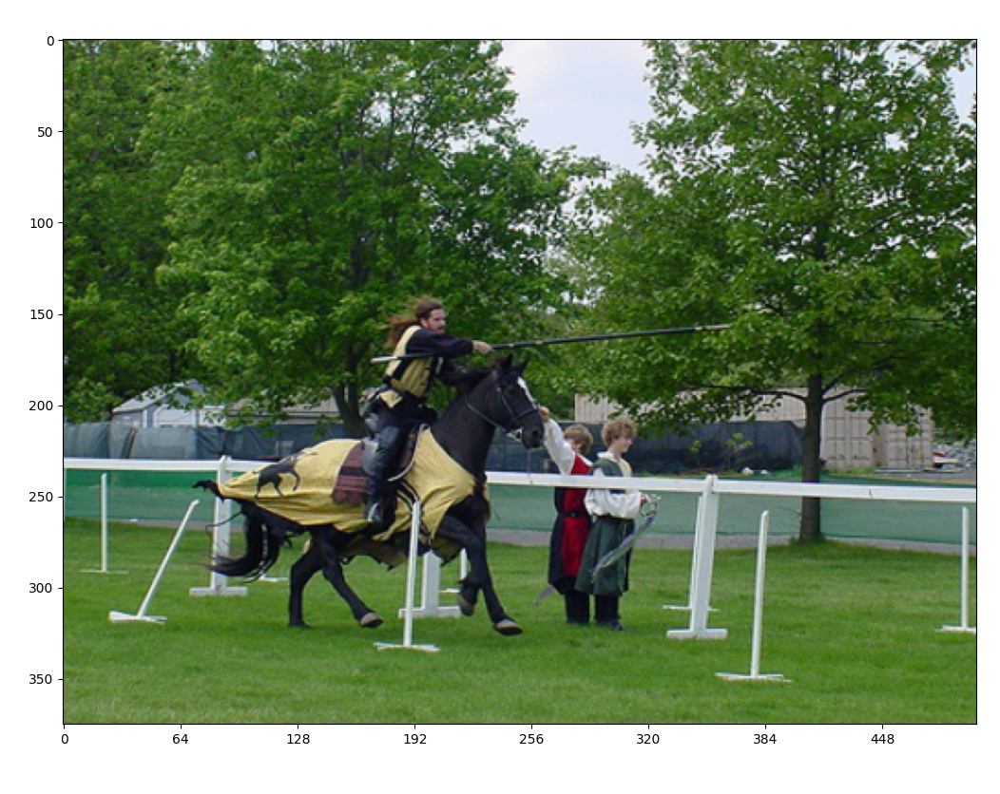

# To Do List
- [x] Downloading and preparing the data
- [x] Building the dataset class
- [x] Building the backbone architecture
- [x] Building the loss class
- [x] Adding data augmentation transforms
- [ ] Building the evaluation metric class
- [ ] Building the train script
- [ ] Building the eval script
- [ ] Building the detect script

<br><br> 

# PASCAL_VOC {2007, 2012} Dataset Loading

## Resizing the dataset
<table>
    <th>
        src
    </th>
    <th>
        resized
    </th>
    <tr>
        <td></td>
        <td></td>
    </tr>
</table>
<br><br>
    
## Dividing the image into S×S grid
<table>
    <th>
        resized
    </th>
    <th>
        grid
    </th>
    <tr>
        <td></td>
        <td></td>
    </tr>
</table>
<br><br>

## Localizing each box into its grid cell
<table>
    <th>
        grid
    </th>
    <th>
        labeled
    </th>
    <tr>
        <td></td>
        <td></td>
    </tr>
    <tr>
</table>
<br><br>

## Applying data augmentation 
> {tweaking intesity, blure, random earasing, horizontal flipping and normalization }
<table>
    <th>
        labeled
    </th>
    <th>
        grid
    </th>
    <tr>
        <td></td>
        <td></td>
    </tr>
</table>
<br><br><br>

# YOLO Architecture

## Darknet Backbone
```
================================================================
Total params: 275,731,794
Trainable params: 275,731,794
Non-trainable params: 0
----------------------------------------------------------------
Input size (MB): 2.30
Forward/backward pass size (MB): 436.87
Params size (MB): 1051.83
Estimated Total Size (MB): 1491.00
----------------------------------------------------------------
```
<br>

## Resnet Backbone
```
================================================================
Total params: 25,877,568
Trainable params: 2,369,536
Non-trainable params: 23,508,032
----------------------------------------------------------------
Input size (MB): 2.30
Forward/backward pass size (MB): 1154.01
Params size (MB): 98.72
Estimated Total Size (MB): 1255.02
----------------------------------------------------------------
```

<br><br><br>

# YOLO Loss


<!--  -->

```latex
\lambda_{coord}\sum_{i=0}^{s^2}\sum_{j=0}^{B}\mathbb{I}^{obj}_{ij}(x_i-\hat{x_i})^2+(y_i-\hat{y_i})^2
+\lambda_{coord}\sum_{i=0}^{s^2}\sum_{j=0}^{B}\mathbb{I}^{obj}_{ij}(\sqrt{w_i}-\sqrt{\hat{w_i}})^2+(\sqrt{h_i}-\sqrt{\hat{h_i}})^2
+\lambda_{noobj}\sum_{i=0}^{s^2}\sum_{j=0}^{B}\mathbb{I}^{noobj}_{ij}(c_i-\hat{c_i})^2
+\sum_{i=0}^{s^2}\sum_{j=0}^{B}\mathbb{I}^{obj}_{ij}(c_i-\hat{c_i})^2
+\sum_{i=0}^{s^2}\mathbb{I}^{obj}_{i}\sum_{c\in{classes}}(p_i(c)-\hat{p}_i(c))^2
```